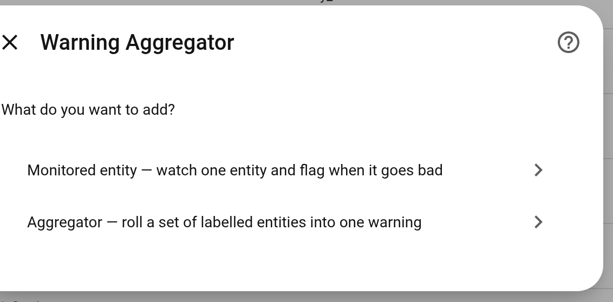
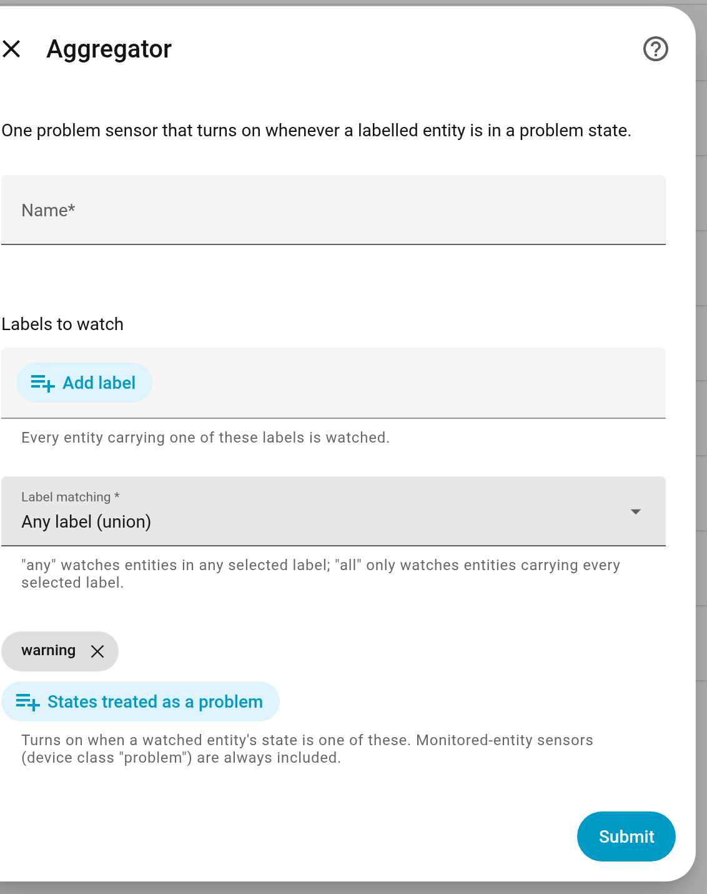
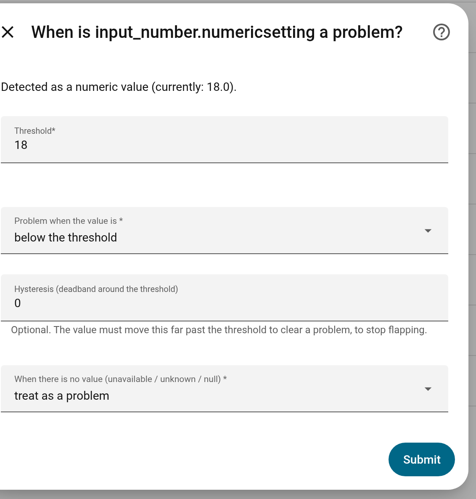
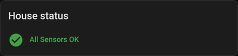

<p align="center">
  
</p>

# Warning Aggregator

[![GitHub Release][release-shield]][releases]
[![License][license-shield]](LICENSE)
[![hacs][hacs-shield]][hacs]
[![Validate][validate-shield]][validate-workflow]
[![Project Maintenance][maintenance-shield]][user_profile]

_Watch anything in Home Assistant, roll it up into **one** problem sensor, and put
it on a dashboard — without writing a single template._

Home Assistant has no built-in way to answer *"is anything in my house in a state
I should know about?"* You end up with a pile of template sensors and a
hand-maintained list in a notification. This integration replaces that with two
UI-configured helpers and a Lovelace card.

- **Monitored entity** — pick any entity; the setup form adapts to whether it is
  a switch, a number or text and asks only the relevant question. Produces one
  `binary_sensor` (device class `problem`).
- **Aggregator** — point it at one or more **labels** and it combines every
  labelled entity into a single `problem` sensor that knows *which* entities are
  tripped.

## Platforms

| Platform | What you get |
| --- | --- |
| `binary_sensor` | One `problem` sensor per **Monitored entity**, and one per **Aggregator**. |
| `sensor` | A `<name> Problem count` for each **Aggregator**. |
| Lovelace card | `custom:warning-aggregator-card`, registered automatically — no resource to add. |

**Requires Home Assistant 2025.1 or newer.**

## Installation

### HACS (recommended)

This is not (yet) in the HACS default list, so add it as a custom repository:

[](https://my.home-assistant.io/redirect/hacs_repository/?owner=bensonrodney&repository=ha-warning-aggregator&category=integration)

1. HACS → **⋮** → **Custom repositories** → add
   `https://github.com/bensonrodney/ha-warning-aggregator`, category **Integration**.
2. Search for **Warning Aggregator**, download it.
3. Restart Home Assistant.

### Manual

Copy `custom_components/warning_aggregator/` from the
[latest release][releases] into `<config>/custom_components/` and restart Home
Assistant.

## Usage

Everything is done in the UI — nothing goes in `configuration.yaml`. The flow is:
create an **aggregator**, feed it by **monitoring entities** (labelled so the
aggregator picks them up), then put the **card** on a dashboard.

### 1. Create an aggregator

An aggregator is the single sensor you'll actually watch. It rolls up every
entity that carries a label you choose.

1. **Make a label** (skip if you have one): **Settings → Areas, labels & zones →
   Labels → Add label**. Call it e.g. `Monitored`.
2. **Settings → Devices & Services → Helpers → ➕ Create Helper → Warning
   Aggregator**.
3. Choose **Aggregator**.

   <picture>
     <source media="(prefers-color-scheme: dark)" srcset="docs/images/wa-menu-dark.png">
     
   </picture>

4. Fill in the form and **Submit**:

   | Field | Set it to |
   | --- | --- |
   | **Name** | e.g. `House status` — you get `binary_sensor.house_status` and `sensor.house_status_problem_count` |
   | **Labels to watch** | `Monitored` |
   | **Label matching** | *Any label* — watch entities in any selected label (*All* = only entities carrying every one) |
   | **States treated as a problem** | leave as `warning` — Monitored-entity sensors are always counted regardless |

<picture>
  <source media="(prefers-color-scheme: dark)" srcset="docs/images/create-aggregator-dark.png">
  
</picture>

`binary_sensor.house_status` is now created. It stays **off** until a monitored
entity trips. To change any of this later: **Helpers →** click the helper **→ the
cog icon**.

Only labels applied **directly** to an entity count — not labels inherited from
its device or area.

### 2. Monitor an entity

Do this once per thing you care about — a battery level, a UPS "battery needs
replacing" sensor, printer toner, a vacuum error code, a temperature that keeps
dropping out…

1. **Settings → Devices & Services → Helpers → ➕ Create Helper → Warning
   Aggregator**.
2. Choose **Monitored entity**.
3. Set **Entity to watch**, optionally a **Name**, and add the **`Monitored`**
   label (so the aggregator from step 1 picks it up). **Submit**.
4. The next form adapts to what that entity is — fill it in and **Submit**:

   | If the entity is… | The form asks |
   | --- | --- |
   | a switch / toggle / `binary_sensor` | **Problem when the state is** → `on` or `off` |
   | a number | **Threshold**, **Problem when the value is** `below` / `above`, and an optional **Hysteresis** (deadband so it doesn't flap around the threshold) |
   | text | **Text to match** (case-insensitive), **Comparison** `equals` / `contains`, and **A match means** `a problem` or `OK` (anything else being the problem) |
   | *any of the above* | **When there is no value** (unavailable / unknown / null) → *treat as a problem* (default) or *treat as OK* |

<picture>
  <source media="(prefers-color-scheme: dark)" srcset="docs/images/monitor-entity-dark.png">
  
</picture>

You get `binary_sensor.<name>` (device class **Problem**) — `on` when the check
fails — with a **`reason`** attribute explaining the verdict (`12 is below 20`,
`'error' matches 'Error'`). Because you labelled it, `binary_sensor.house_status`
now counts it.

The cog icon re-tunes the thresholds. To watch a *different* entity, delete the
helper and make a new one.

> You can also skip the wrapper: put the `Monitored` label straight onto any
> native `problem` binary_sensor and the aggregator will include it.

### 3. Add the card to a dashboard

The card registers itself once you have at least one helper — no resource to add.

1. Open the dashboard → **✏️ (Edit dashboard)** top-right → **➕ Add card**.
2. Search for **Warning Aggregator** (it's under *Custom*). If it's missing,
   hard-refresh the browser (**Ctrl/Cmd-Shift-R**).
3. In the card editor set **Aggregator sensor** to `binary_sensor.house_status`.
   Optionally change the title, the "all OK" text, or tick *hide when everything
   is OK*.
4. **Save**.

Green **"All Sensors OK"** when nothing is wrong; otherwise a warning header with
the count and a tap-through list of the tripped monitors (tap a row for its
more-info dialog).

<p>
  <picture>
    <source media="(prefers-color-scheme: dark)" srcset="docs/images/card-ok-dark.png">
    
  </picture>
  <picture>
    <source media="(prefers-color-scheme: dark)" srcset="docs/images/card-problem-dark.png">
    
  </picture>
</p>

<details><summary>YAML / all card options</summary>

```yaml
type: custom:warning-aggregator-card
entity: binary_sensor.house_status
# title: House status                  # optional, defaults to the sensor's name
# ok_text: All Sensors OK              # optional
# problem_text: Sensors need attention # optional (header when tripped)
# hide_when_ok: false                  # optional — render nothing while all OK
```

**Label mode** — build the list from a label instead of an aggregator sensor
(works with the plain [template-helper pattern][pattern], no integration entity
needed):

```yaml
type: custom:warning-aggregator-card
label: monitored
problem_states: [warning]   # states counted as a problem (default: [warning])
```
</details>

### Get notified

One automation, off the aggregator, naming what tripped:

```yaml
alias: Notify on house warning
mode: single
triggers:
  - trigger: state
    entity_id: binary_sensor.house_status
    from: "off"
    to: "on"
variables:
  tripped: "{{ state_attr('binary_sensor.house_status', 'problem_names') }}"
actions:
  - action: notify.mobile_app_phone
    data:
      title: "⚠️ House warning"
      message: >-
        {{ tripped | length }} need attention: {{ tripped | join(', ') }}
```

## Entities & attributes

| Entity | Source | Key attributes |
| --- | --- | --- |
| `binary_sensor.<name>` | Monitored entity | `watched_entity`, `watched_state`, `kind`, `reason` |
| `binary_sensor.<name>` | Aggregator | `problem_entities`, `problem_names`, `problem_count`, `watched_count`, `watched_entities`, `labels`, `match` |
| `sensor.<name>_problem_count` | Aggregator | `problem_entities`, `problem_names` |

## FAQ

**The new helper / card doesn't show up.**
Restart Home Assistant after installing, then hard-refresh the browser
(Ctrl/Cmd-Shift-R) so the frontend picks up the card.

**Does an Aggregator need a label to exist first?**
Yes — create at least one label under **Settings → Areas, labels & zones →
Labels**, then apply it to the entities (or Monitored entity helpers) you want
watched.

**Can I watch a native `binary_sensor` that's already a `problem` sensor?**
Yes — just label it and an Aggregator will include it, no Monitored entity
wrapper needed.

**Why is my sensor `on` when the source is `unavailable`?**
That's the default (a sensor that stopped reporting is usually worth knowing
about). Change **"When there is no value"** to *treat as OK* in the helper's
options.

**Multiple aggregators?**
Yes — add as many as you like, each with its own labels, sensor and card.

## Roadmap

- An `expired` check — problem when a timestamp is older than _N_.
- Acknowledge / snooze per tripped entity, with services, automation triggers and
  card buttons.
- Device- and area-inherited label expansion as an option.
- Change the watched entity from the options flow.

## Contributing

Issues and PRs welcome.

```bash
make test           # pytest (uv fetches Python 3.13 + test deps)
make lint           # ruff check + format --check
make hacs           # offline HACS checks
make version        # print the current version
```

`scripts/deploy-sandbox.sh` deploys the working tree into a local Docker Home
Assistant for manual testing.

### Releasing

The version lives in one place — `custom_components/warning_aggregator/manifest.json`
(the card's banner is kept in sync). To cut a release:

```bash
make release              # 0.1.0 -> 0.1.1
make release BUMP=minor   # 0.1.0 -> 0.2.0
make release SET=1.0.0
```

That bumps the version, commits `Release vX.Y.Z`, tags it, and pushes to **every**
git remote. The `release` job in `ci.yml` then — once lint and tests pass —
verifies the tag matches `manifest.json`, builds `warning_aggregator.zip`
(what `hacs.json`'s `zip_release` points at), and publishes the release:
a **GitHub Release** on GitHub (the source of truth for versions) and a mirrored
**Gitea Release** on Gitea.

The Gitea release job needs a repo secret **`GITEA_TOKEN`** with release write
access (*Settings → Actions → Secrets*). HACS installs nothing until the first
release exists.

## Credits

Inspired by the community "one System Warning sensor" [template-helper
pattern][pattern]. README structure follows
[`integration_blueprint`](https://github.com/ludeeus/integration_blueprint).

---

[hacs]: https://github.com/hacs/integration
[hacs-shield]: https://img.shields.io/badge/HACS-Custom-41BDF5.svg?style=for-the-badge
[releases]: https://github.com/bensonrodney/ha-warning-aggregator/releases
[release-shield]: https://img.shields.io/github/v/release/bensonrodney/ha-warning-aggregator?style=for-the-badge
[license-shield]: https://img.shields.io/github/license/bensonrodney/ha-warning-aggregator.svg?style=for-the-badge
[maintenance-shield]: https://img.shields.io/badge/maintainer-%40bensonrodney-blue.svg?style=for-the-badge
[user_profile]: https://github.com/bensonrodney
[validate-workflow]: https://github.com/bensonrodney/ha-warning-aggregator/actions/workflows/validate.yml
[validate-shield]: https://img.shields.io/github/actions/workflow/status/bensonrodney/ha-warning-aggregator/validate.yml?style=for-the-badge&label=validate
[pattern]: https://github.com/bensonrodney/ha-warning-aggregator/blob/main/docs/pattern.md
