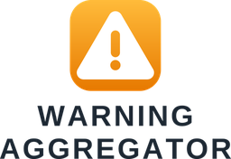
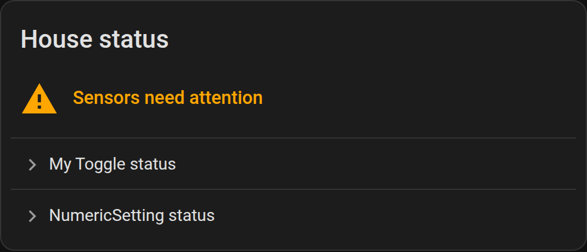

<p align="center">
  
</p>

# Warning Aggregator

[![GitHub Release][release-shield]][releases]
[![License][license-shield]](LICENSE)
[![hacs][hacs-shield]][hacs]
[![Validate][validate-shield]][validate-workflow]
[![Project Maintenance][maintenance-shield]][user_profile]

_Watch anything in Home Assistant, roll it up into **one** problem sensor, and put
it on a dashboard — without writing a single template._

Home Assistant has no built-in way to answer *"is anything in my house in a state
I should know about?"* You end up with a pile of template sensors and a
hand-maintained list in a notification. This integration replaces that with two
UI-configured helpers and a Lovelace card.

- **Monitored entity** — pick any entity; the setup form adapts to whether it is
  a switch, a number or text and asks only the relevant question. Produces one
  `binary_sensor` (device class `problem`).
- **Aggregator** — point it at one or more **labels** and it combines every
  labelled entity into a single `problem` sensor that knows *which* entities are
  tripped.

<!-- Screenshots: add PNGs under docs/images/ and uncomment.



-->

## Platforms

| Platform | What you get |
| --- | --- |
| `binary_sensor` | One `problem` sensor per **Monitored entity**, and one per **Aggregator**. |
| `sensor` | A `<name> Problem count` for each **Aggregator**. |
| Lovelace card | `custom:warning-aggregator-card`, registered automatically — no resource to add. |

**Requires Home Assistant 2025.1 or newer.**

## Installation

### HACS (recommended)

This is not (yet) in the HACS default list, so add it as a custom repository:

[](https://my.home-assistant.io/redirect/hacs_repository/?owner=bensonrodney&repository=ha-warning-aggregator&category=integration)

1. HACS → **⋮** → **Custom repositories** → add
   `https://github.com/bensonrodney/ha-warning-aggregator`, category **Integration**.
2. Search for **Warning Aggregator**, download it.
3. Restart Home Assistant.

### Manual

Copy `custom_components/warning_aggregator/` from the
[latest release][releases] into `<config>/custom_components/` and restart Home
Assistant.

## Configuration

Everything is configured in the UI — there is nothing to add to
`configuration.yaml`.

**Settings → Devices & Services → Helpers → ➕ Create Helper → Warning
Aggregator**, then choose a helper type.

### Monitored entity

Pick the entity to watch. The next step depends on what that entity is:

| Entity is… | You choose |
| --- | --- |
| a switch / toggle / `binary_sensor` | which state — `on` or `off` — is the problem |
| a number | a **threshold**, whether **below** or **above** it is the problem, and an optional **hysteresis** (deadband so it doesn't flap around the threshold) |
| text | a string to **match** (case-insensitive), **equals** vs **contains**, and whether a match means **a problem** or **OK** (anything else being the problem) |
| _any of the above_ | what an **unavailable / unknown / null** value means — **a problem** (default) or **OK** |

The result is one `binary_sensor` with device class `problem` (`on` = something is
wrong) and a `reason` attribute that explains the current verdict, e.g.
`12 is below 20` or `'error' matches 'Error'`.

You can assign **labels** in the same step so an Aggregator picks the sensor up.

> To watch a *different* entity, remove the helper and add a new one — the
> **Configure** button only re-tunes the thresholds for the entity you chose.

### Aggregator

| Option | Meaning |
| --- | --- |
| **Labels to watch** | Every entity carrying one of these labels is watched. |
| **Label matching** | `any` — entities in *any* selected label (union). `all` — only entities carrying *every* selected label (intersection). |
| **States treated as a problem** | The sensor is `on` when a watched entity's state is one of these (default: `warning`). `problem`-class binary sensors that are `on` — including every **Monitored entity** helper — always count, with no configuration. |

Only labels applied **directly** to an entity are considered; labels inherited
from a device or area are not (see [Roadmap](#roadmap)).

## The Lovelace card

The integration serves `custom:warning-aggregator-card` and loads it on the
frontend automatically. Edit a dashboard → **➕ Add card** → **Warning
Aggregator**. It shows a green *"All Sensors OK"*, or a warning header with a
tap-through list of the monitors that are not OK.

```yaml
type: custom:warning-aggregator-card
entity: binary_sensor.house_status
# title: House status                  # optional, defaults to the sensor's name
# ok_text: All Sensors OK              # optional
# problem_text: Sensors need attention # optional (header when tripped)
# hide_when_ok: false                  # optional — render nothing while all OK
```

The card also has a **label mode** that builds the list itself from an entity
label, so it works even without an Aggregator sensor (or against the plain
[template-helper pattern][pattern]):

```yaml
type: custom:warning-aggregator-card
label: monitored
problem_states: [warning]   # states counted as a problem (default: [warning])
```

## Recommended setup

1. Add a **Monitored entity** for each thing you care about — battery levels, a
   UPS "replace battery" sensor, printer toner, a vacuum error code, a
   temperature that stopped reporting…
2. Give them all one shared label, e.g. `monitored`.
3. Add one **Aggregator** watching that label.
4. Put the card on a dashboard, and hang a single notification automation off the
   aggregator:

```yaml
alias: Notify on house warning
mode: single
triggers:
  - trigger: state
    entity_id: binary_sensor.house_status
    from: "off"
    to: "on"
variables:
  tripped: "{{ state_attr('binary_sensor.house_status', 'problem_names') }}"
actions:
  - action: notify.mobile_app_phone
    data:
      title: "⚠️ House warning"
      message: >-
        {{ tripped | length }} need attention: {{ tripped | join(', ') }}
```

## Entities & attributes

| Entity | Source | Key attributes |
| --- | --- | --- |
| `binary_sensor.<name>` | Monitored entity | `watched_entity`, `watched_state`, `kind`, `reason` |
| `binary_sensor.<name>` | Aggregator | `problem_entities`, `problem_names`, `problem_count`, `watched_count`, `watched_entities`, `labels`, `match` |
| `sensor.<name>_problem_count` | Aggregator | `problem_entities`, `problem_names` |

## FAQ

**The new helper / card doesn't show up.**
Restart Home Assistant after installing, then hard-refresh the browser
(Ctrl/Cmd-Shift-R) so the frontend picks up the card.

**Does an Aggregator need a label to exist first?**
Yes — create at least one label under **Settings → Areas, labels & zones →
Labels**, then apply it to the entities (or Monitored entity helpers) you want
watched.

**Can I watch a native `binary_sensor` that's already a `problem` sensor?**
Yes — just label it and an Aggregator will include it, no Monitored entity
wrapper needed.

**Why is my sensor `on` when the source is `unavailable`?**
That's the default (a sensor that stopped reporting is usually worth knowing
about). Change **"When there is no value"** to *treat as OK* in the helper's
options.

**Multiple aggregators?**
Yes — add as many as you like, each with its own labels, sensor and card.

## Roadmap

- An `expired` check — problem when a timestamp is older than _N_.
- Acknowledge / snooze per tripped entity, with services, automation triggers and
  card buttons.
- Device- and area-inherited label expansion as an option.
- Change the watched entity from the options flow.

## Contributing

Issues and PRs welcome. To run the checks locally:

```bash
uv run --with pytest-homeassistant-custom-component --with home-assistant-frontend pytest
uvx ruff check . && uvx ruff format --check .
```

`scripts/deploy-sandbox.sh` deploys the working tree into a local Docker Home
Assistant for manual testing.

## Credits

Inspired by the community "one System Warning sensor" [template-helper
pattern][pattern]. README structure follows
[`integration_blueprint`](https://github.com/ludeeus/integration_blueprint).

---

[hacs]: https://github.com/hacs/integration
[hacs-shield]: https://img.shields.io/badge/HACS-Custom-41BDF5.svg?style=for-the-badge
[releases]: https://github.com/bensonrodney/ha-warning-aggregator/releases
[release-shield]: https://img.shields.io/github/v/release/bensonrodney/ha-warning-aggregator?style=for-the-badge
[license-shield]: https://img.shields.io/github/license/bensonrodney/ha-warning-aggregator.svg?style=for-the-badge
[maintenance-shield]: https://img.shields.io/badge/maintainer-%40bensonrodney-blue.svg?style=for-the-badge
[user_profile]: https://github.com/bensonrodney
[validate-workflow]: https://github.com/bensonrodney/ha-warning-aggregator/actions/workflows/validate.yml
[validate-shield]: https://img.shields.io/github/actions/workflow/status/bensonrodney/ha-warning-aggregator/validate.yml?style=for-the-badge&label=validate
[pattern]: https://github.com/bensonrodney/ha-warning-aggregator/blob/main/docs/pattern.md
